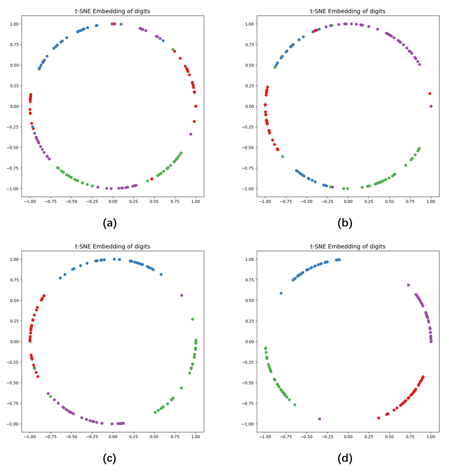

# OFR
This is an open source code about occluded face recognition algorithm. In the test of the occluded face recognition algorithm, we verify the effectiveness of the designed algorithm for occlusion location and occluded face recognition. The performance test results of the face recognition algorithm based on occlusion detection are as follows: In the AR and LFW occlusion dataset tests, the algorithm achieves 100% and 98.83% respectively, which are higher than the mainstream occluded face recognition such as PDSN and FROM. Algorithm. In the maximum occlusion block size test of the [GFRTD](https://github.com/bonjourdrs/GFRTD) test dataset, this algorithm increased the 45 pixels of the original most advanced occluded face recognition algorithm FROM to 60 pixels of this algorithm, which significantly increased the maximum identifiable occlusion block size. 

**Test Result**

Arcface (a), arcface (b) based on occlusion training, lightweight versions of our-m-f-c (c) and our-r (d) recognition result classification effect. Among them, (a) is the traditional face recognition algorithm, (b) is the arcface algorithm based on occlusion training enhancement, and (c) is the lightweight algorithm in this study, which is about one seventh of the complexity of the main algorithm (d) in this study. In lfw-occ, four classes are randomly selected, and 35 samples of each class are used as test data. The 512 dimensional space of recognition features is transformed into one-dimensional angle space and normalized by t-sne algorithm, and the feature distribution is visualized. The marks in different colors represent different categories.

**AR dataset**

| Network  | Sunglass | Scarf |
| -------- | -------- | ----- |
| SRC      | 87.00    | 59.50 |
| RPSM     | 96.00    | 97.66 |
| ArcFacet | 95.14    | 99.72 |
| FaceNet  | 93.99    | 97.25 |
| MaskNet  | 90.90    | 96.70 |
| PDSN     | 99.72    | 100   |
| FROM     | 100      | 100   |
| Our-R    | 100      | 100   |

 **LFW dataset**

| NetWork    | LFW   | LFW   | LFW-OCC | LFW-OCC | LFW-MASK | LFW-MASK | LFW-GLASS | LFW-GLASS |
| ---------- | ----- | ----- | ------- | ------- | -------- | -------- | --------- | --------- |
|            | ACC   | AUC   | ACC     | AUC     | ACC      | AUC      | ACC       | AUC       |
| FaceNet-R  | 98.94 | 99.88 | 89.35   | 92.64   | 94.95    | 98.35    | 95.95     | 98.78     |
| FaceNet-M  | 98.59 | 99.80 | 87.96   | 91.02   | 92.84    | 96.68    | 92.91     | 97.43     |
| ArcFacet-R | 98.36 | 99.63 | 96.00   | 98.51   | 97.97    | 99.52    | 94.28     | 97.64     |
| ArcFacet-M | 97.44 | 99.24 | 91.80   | 95.39   | 91.61    | 95.14    | 91.88     | 95.59     |
| FROM       | 99.30 | 99.90 | 97.11   | 99.18   | 96.52    | 98.91    | 97.87     | 99.59     |
| Our-R      | 99.52 | 99.91 | 98.83   | 99.86   | 98.95    | 99.79    | 98.84     | 99.89     |
| Our-M      | 98.47 | 99.63 | 96.81   | 99.03   | 97.90    | 99.40    | 96.00     | 98.72     |

**GFRTD dataset**

| test dataset | OCC  | ArcFacet-R | FaceNet-R | FROM  | Our-R |
| ------------ | ---- | ---------- | --------- | ----- | ----- |
| GFRTD        | 0.05 | 83.43      | 85.00     | 91.10 | 90.45 |
| FACE         | 0.20 | 79.54      | 72.15     | 79.77 | 87.03 |
| EAR          | 0.10 | 82.32      | 84.60     | 90.78 | 90.28 |
| GLASSES      | 0.34 | 69.56      | 70.75     | 78.30 | 84.22 |
| HEAD         | 0.06 | 71.78      | 77.45     | 84.07 | 85.27 |
| MASK         | 0.37 | 80.83      | 72.50     | 81.87 | 85.42 |
| NOSE         | 0.23 | 79.77      | 78.95     | 83.34 | 87.38 |

**GFRTD dataset**

| OCC block size | OCC  | ArcFacet-R | FaceNet-R | FROM  | Our-R |
| -------------- | ---- | ---------- | --------- | ----- | ----- |
| 5              | 0.05 | 82.08      | 83.87     | 90.89 | 91.04 |
| 10             | 0.07 | 82.00      | 82.49     | 89.31 | 89.87 |
| 15             | 0.11 | 80.47      | 81.20     | 86.30 | 88.08 |
| 20             | 0.15 | 79.25      | 80.09     | 86.71 | 87.85 |
| 25             | 0.20 | 78.40      | 77.77     | 84.51 | 88.64 |
| 30             | 0.24 | 76.61      | 74.58     | 83.43 | 87.12 |
| 35             | 0.29 | 74.91      | 74.50     | 80.70 | 86.80 |
| 40             | 0.33 | 71.49      | 71.95     | 77.13 | 85.33 |
| 45             | 0.38 | 70.11      | 69.55     | 74.23 | 82.29 |
| 50             | 0.42 | 68.53      | 65.42     | 70.54 | 80.44 |
| 55             | 0.47 | 66.22      | 65.18     | 66.68 | 78.24 |
| 60             | 0.51 | 64.43      | 62.40     | 64.86 | 76.34 |
| 65             | 0.54 | 62.53      | 60.64     | 63.16 | 75.34 |
| 70             | 0.58 | 59.28      | 59.21     | 59.56 | 71.77 |
| 75             | 0.60 | 58.99      | 58.10     | 57.28 | 68.43 |
| 80             | 0.63 | 56.53      | 55.34     | 56.43 | 67.94 |
| 85             | 0.65 | 57.26      | 53.50     | 53.06 | 65.22 |
| 90             | 0.66 | 55.71      | 53.30     | 52.15 | 60.82 |
| 95             | 0.67 | 54.42      | 52.21     | 52.74 | 60.59 |
| 100            | 0.69 | 52.69      | 50.40     | 52.10 | 58.16 |

If you have any questions, please contact us drsseu@outlook.com.
